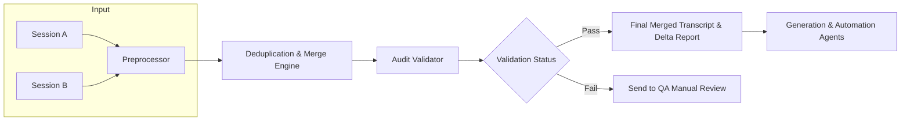

# AI Unified Hierarchy
A unified, audit-ready hierarchy for multi-session AI system integration, creative orchestration, and audio-informed generative music workflows.

# 1. Introduction and Purpose
## 1.1 Objectives
- Merge all conversation inputs and uploaded documents into a unified hierarchy.

- Preserve policies, processes, procedures, workflows, guardrails, key insights, prompts, AI roles, numbered lists, outlines, and step-by-step instructions with **maximal verbosity** for executability and auditability.

- Optimize the hierarchy for clarity, modularity, and AI inference, including token-efficient continuity snapshots and reusable prompt scaffolds.

## 1.2 Target Audience and Use Cases
- AI system architects and prompt engineers designing multi-agent, multi-session systems.

- Musicologists, producers, and audio system tuners seeking method-to-mix translation into generative workflows.

- Quality assurance and change-management teams performing validation, regression checks, and version control on evolving prompt systems.

- Multi-session chat analysis and internal audit functions requiring traceability, provenance, and delta reporting.

# 2. Core Frameworks and High-Level Taxonomy
## 2.1 RECA and Decision Trees
### 2.1.1 RECA Framework
- **Sense:** Extract intent, constraints, environment, tools available, and the user’s definition of “done.”

- **Think:** Form hypotheses, identify gaps/unknowns, detect contradictions, and select appropriate frameworks and tools.

- **Act:** Produce executable next steps, outputs, or prompts; include verification/audit steps; produce deltas and version stamps.

### 2.1.2 Decision Tree Guidance
- Branch on **user intent** (analysis vs synthesis vs evaluation vs implementation).

- Branch on **content type** (audio tuning vs prompt templates vs multi-session integration vs system architecture).

- Branch on **risk level** (low-stakes creative iteration vs high-stakes instructions with safety/compliance implications).

## 2.2 Situation-Dependent Frameworks
### 2.2.1 SWOT Analysis
- Strengths, weaknesses, opportunities, threats applied to: conversational performance, system design proposals, workflow designs, and model behavior.

- Trigger when evaluating tradeoffs, risk posture, feasibility, or why an approach may fail in deployment.

### 2.2.2 Tri-Attention Framework
- **Content:** The literal text/audio inputs, parameters, instructions, and artifacts.

- **Context:** Conversation history, user preferences, prior constraints, continuity snapshots, and accumulated state.

- **Process:** Reasoning steps, invoked workflows, tooling, checkpoints, QA passes, and validation results.

## 2.3 Deep-Dive Methods
### 2.3.1 5 Whys Root Cause Analysis
- Trigger for troubleshooting (prompt misfires, adherence failures, persona drift, muddiness/cancellation in audio outputs, workflow breakdown).

- Continue until a correctable root factor is identified, not merely a symptom.

### 2.3.2 Tree-of-Thoughts
- Generate multiple candidate reasoning branches for complex tasks (multi-agent orchestration, multi-document integration, competing constraints).

- Prune branches based on relevance to user goals, verifiability, and workflow executability.

# 3. Extended Functionality Phases: Devika Multi-Layered Analysis
## 3.1 Phase 1: Advanced Contextual Review
- Apply Tri-Attention + Tree-of-Thoughts to the entire target session/module.

- Document objectives, tool constraints, role definitions, and key “turning points” in user intent.

## 3.2 Phase 2: Parsing for Key Elements
- Extract and preserve: policies, processes, procedures, workflows, guardrails.

- Extract and preserve: numbered lists, step-by-step instructions, outlines, prompt templates, decision logic.

## 3.3 Phase 3: Multi-Perspective Deep-Dive Analysis
- Technical perspective: architecture, tools, modules, constraints, data contracts.

- Strategic perspective: project goals, long-term vision, adoption/OSS strategy.

- Ethical perspective: bias mitigation, provenance, PII handling, content policy compliance.

- User experience perspective: clarity, usability, cognitive load, iteration speed.

- Innovation perspective: new prompting strategies, advanced orchestration patterns, emerging integrations.

## 3.4 Phase 4: AI Self-Evaluation
- Score: responsiveness, accuracy, relevance, proactivity, clarity, user satisfaction.

- Identify “miss modes” (e.g., drifting into Q&A when cumulative conversational mode is required).

## 3.5 Phase 5: Synthesis and Presentation
- Compile a structured report with actionable recommendations.

- Produce hierarchical outline updates plus delta reports suitable for versioning.

# 4. Session Decomposition and Starter Kit: Universal GPT Session Decomposer
## 4.1 Session Purpose and Analysis Template
- Primary intent: user’s high-level goal.

- Secondary goals: subgoals and iterative tasks.

- Tone and engagement: style, friction points, user corrections, engagement peaks.

## 4.2 Confidence Grid Template
- Explicitness (stated vs inferred).

- Recurrence (how often it appears).

- Tone stability (consistent vs drifting).

- Final score (used to decide whether to ask for clarification or proceed).

## 4.3 Decision Logic Block
- Branch rules based on intent and content type.

- Include fallback logic when information is missing or ambiguous.

## 4.4 Guardrails Template
- Maintain clarity and transparency.

- Avoid banned content and harmful instructions.

- Explicitly withdraw assertions when wrong; log corrections and rationale.

## 4.5 JSON Bundle Format
- Provide machine-readable modules: roles, decision_logic, guardrails, SOP tasks, schemas.

# 5. Core Instruction Prompts and Execution Templates
## 5.1 Instruction Core Prompt: Devika Multi-Layered Analysis Trigger
- Activate tri-attention + tree-of-thoughts.

- Identify and extract embedded policies/processes/workflows.

- Apply multi-perspective frameworks (SWOT, 5 Whys) when triggered.

- Maintain an internal checklist updated each pass.

- Present outputs only after analysis completes, with delta logs.

## 5.2 Prompt Template Execution: Sample Trigger Pattern
- Structured, multi-layered analysis without additional user input.

- Output in keyword-dense paragraphs with markdown headings.

## 5.3 Reusable Decomposer Shell Template
- Parse session → segment stages → identify purpose → extract workflows.

- Output modules: Role Definition Prompt, Decision Logic Blocks, Method Modules, Guardrails, XAI insights, SOPs.

# 6. Session Evaluation and Reporting
## 6.1 Session Evaluation Report Structure
- Phase 1: Advanced Contextual Review — key takeaways.

- Phase 2: Parsing for Key Elements — extracted taxonomies, tools, constraints.

- Phase 3: Multi-Perspective Analysis — technical/strategic/ethical/UX/innovation.

- Phase 4: AI Self-Evaluation — rubric + scores + drift detection.

- Phase 5: Final Synthesis — consolidated recommendations and next actions.

## 6.2 Deliverables
- Context Map: full outline of session with methods and phases.

- Parsed Policies and Processes: extracted workflows, guardrails, prompt structures.

- Analysis Perspectives: multi-angle breakdowns.

- AI Self-Evaluation: scorecard and next steps.

- Final Action Report: prioritized actions and reusable SOP templates.

# 7. Instructional Modules for Collaborative Analysis and Prompt Engineering
## 7.1 Multi-Agent Collaboration Roles
- Process Engineer: process flows, efficiency, dedup logic.

- QA / Change Management PM: audit, compliance, version control, delta tracking.

- Prompt Engineer (Advanced Data Analytics): prompt optimization, bias mitigation, inference efficiency.

- Creative Collaborator / Mentor: narrative refinement, domain expertise injection, artistic coherence.

## 7.2 Project Team Meeting Prompt Pattern
- Simulate turn-by-turn contributions from each role.

- Identify automation opportunities, risks, mitigations.

- Require explicit withdrawal when wrong; log corrections and why.

## 7.3 Refined Collaborative Prompt Template
- Analyze current conversation from start to latest response.

- Each role extracts insights and proposes improvements.

- Final deliverable: structured report with prioritized suggestions, feasibility assessment, and sample prompts.

# 8. Multi-Session Integration, Deduplication and Audit
## 8.1 Session History Inventory
- Session A: current chat transcript.

- Session B: additional sessions/modules.

- Metadata: dates, participants/roles, attachments, key topics.

## 8.2 Preprocessing and Alignment
- Extract/normalize text from all sessions.

- Tokenize by utterance, paragraph, heading, or topic.

- Assign timestamps or turn indices for ordering.

## 8.3 Duplicate Detection and Merging Strategy
- Exact matching: verbatim duplicates → canonical block with source tags.

- Fuzzy matching: semantic similarity → fused core + unique qualifiers.

- Preserve unique elaborations as sub-nodes with session tags.

## 8.4 Audit and Validation Layer
- Verification: no missing context, no contradictions, guardrail compliance.

- Validation: semantic coherence, factual consistency, policy compliance.

- Remediation suggestions: missing context insertion points, conflict flags for QA review.

- Tamper-proof logs: version stamps, delta reports, retention schedules.

# 9. Component and Architecture Design
## 9.1 Three-Tier Hierarchy
### 9.1.1 Tier 1: Input Modules
- Session Fetcher.

- Preprocessor (normalize/tokenize/dedupe).

- Source Metadata Manager (session IDs, timestamps, attachment map).

### 9.1.2 Tier 2: Analysis and Structure Modules
- Hierarchical Segmentation (phrase trees, section detectors).

- Topic/Intent Classifier.

- Deduplication and Merge Engine.

- Audit Validator.

### 9.1.3 Tier 3: Generation and Agents
- Fractal Pattern Generator.

- GPT Compositional Agents (MelodyAgent, LyricAgent, CriticAgent).

- Process Engineer Agent.

- QA/PM Agent.

- Prompt Engineer (Data Analytics) Agent.

## 9.2 Inter-Module Data Contracts
### 9.2.1 Canonical Content Block Schema (CB_)
- CB_Text.

- CB_SourceSessions.

- CB_MergeType (Exact, Near, Unique).

- CB_UniqueTraits.

- CB_AuditFlags (Conflict, MissingContext, Inconsistency).

### 9.2.2 Hierarchy Node Schema (HN_)
- HN_NodeID.

- HN_ParentNodeID.

- HN_ContentType.

- HN_SessionTags.

- HN_Timestamp.

### 9.2.3 Validation Result Schema (VR_)
- VR_RuleID.

- VR_Status (Pass/Fail).

- VR_Details.

- VR_RemediationSuggestion.

# 10. External System Integrations
## 10.1 ChatGPT Web and Custom GPT Builder
- Custom GPT Actions for deduplication, audit tasks, template generation.

- Portfolio workspaces for transcripts, audit logs, unique trait tables.

## 10.2 Third-Party Audio/DAW Integration
- Suno audio analysis modules (prompt-to-audio evaluation).

- Upload/download via portfolio workspaces.

- Format validation for audio/MIDI/text.

## 10.3 Broker and Queue Layer
- Deduplication jobs (fuzzy scanning).

- Audit validation jobs (consistency checks).

- Caching merged patterns for speed.

## 10.4 Security and Performance Considerations
- Async file I/O.

- Rate limits (e.g., merge throughput).

- Encryption-at-rest for merged transcripts and logs.

# 11. Security Architecture
## 11.1 Authentication and Authorization
- OAuth token delegation.

- RBAC among agents.

## 11.2 Data Protection and Sanitization
- Upload validation (size/type).

- Content sanitization (strip PII, remove malicious metadata).

## 11.3 Audit and Validation Layer
- Verify: no missing context, no contradictions, guardrail compliance.

- Validate: semantic coherence, factual consistency.

## 11.4 Logging and Monitoring
- Tamper-proof audit trails.

- Retention and deletion policies.

- Anomaly detection for tampering.

# 12. Performance, Scalability and Resilience
## 12.1 Horizontal Scaling
- Stateless merge workers.

- Partitioning by session ID.

## 12.2 Rate Limiting and Fallbacks
- Max merges per minute.

- Side-by-side comparison mode on failures.

## 12.3 Fault Tolerance
- Retry logic.

- Graceful degradation (mark “Pending QA” on timeout).

## 12.4 Containerized Deployments
- Slim images bundling audio/ML tools.

- Health checks and autoscaling policies.

# 13. Data Management and Storage Security
## 13.1 Data Flow Optimization
- Raw session data → Preprocessed CB_ blocks → Merged transcript → Audit logs.

## 13.2 Client Isolation
- Segregated workspace folders per conversation ID.

- Scoped tokens.

## 13.3 File Lifecycle and Retention Policies
- Raw transcripts purged after 60 days.

- Merged transcripts archived 180 days.

- Audit logs retained 365 days.

## 13.4 Versioning and Change Tracking
- Git-like version stamps on merged transcripts.

- Delta reports stored per version.

# 14. Maintainability, Flexibility and Future Growth
## 14.1 Modular Agent Registration
- Plug-in dedupe kernels.

- Swap audit rule libraries.

## 14.2 Prompt Versioning and Schema Registry
- JSON schemas for CB_, HN_, VR_.

- Dictionary of prompt templates for merge/audit/summarize.

## 14.3 Extension Points
- Live-streaming merge.

- Multi-track audio integration.

- Integration with third-party models where available.

## 14.4 Documentation and Onboarding
- Consistent naming (Tier1/Tier2/Tier3).

- Mermaid diagrams for merge/audit flows.

- Glossary for key enums and terms.

# 15. Risk Identification and Improvement Recommendations
## 15.1 Third-Party Dependencies
- API change risk.

- Link health checks.

## 15.2 Real-Time Interaction Constraints
- Token window management via checkpoints and anchor phrases.

## 15.3 Security and Data Leakage
- Strict sanitization and sandboxing.

## 15.4 Performance Bottlenecks
- Incremental merge.

- Parallel validation.

## 15.5 Data Management Gaps
- Enforce retention schedules.

## 15.6 Semantic Deduplication Challenges
- Threshold tuning + human-in-loop on edge cases.

## 15.7 Audit Rule Library Optimization
- Reduce false positives/negatives via iterative refinement.

# 16. Audio System Optimization
## 16.1 Baseline Principles
- Start flat, set clean gain structure first, then crossovers, then time alignment, then EQ.

- Prefer cuts over boosts when possible, unless compensating for environmental masking.

- Use measurement when feasible (RTA, calibrated mic) and validate in the actual listening environment.

## 16.2 Signal Chain Tiers (Production-Transferable)
- Raw input normalization (gain staging, headroom budgeting).

- Preamp coloring (tube/solid-state emulation or harmonic saturation targets).

- Dynamic sculpting (parallel compression, transient shaping).

- Stereo field expansion (phase-coherent width, mid/side balance).

- Psychoacoustic EQ correction (masking management, ear sensitivity compensation).

- Mix finalizer (limiting, loudness targets, translation checks).

## 16.3 Mobile/Environmental Tuning Logics (Motorcycle-Grade)
- High wind/noise environments mask lows and highs; prioritize 1.5–3 kHz projection for intelligibility.

- Open-air setups invalidate room simulations; test in situ.

- Helmet acoustics: increase vocal presence and manage harshness without losing clarity.

- Voltage sag: use voltage-aware limiting to prevent clipping under load.

## 16.4 Audio-Informed Composition Logic (Arrangement ↔ Frequency)
### 16.4.1 Instrument Occupancy Map (IOM)
- **Purpose:** Treat arrangement as frequency-domain scheduling to avoid mud, cancellation, and masking.

- **Method:** Assign every instrument a primary band, a harmonic band, and a transient band, then verify overlap rules.

- **IOM Bands (Actionable Defaults):**
  - Sub-bass: 20–60 Hz (feel, weight).

  - Bass fundamentals: 60–120 Hz (kick/bass competition zone).

  - Punch/body: 120–250 Hz (mud danger, warmth).

  - Low mids: 250–500 Hz (boxiness risk, density).

  - Presence: 1–4 kHz (intelligibility, vocal edge).

  - Air: 8–16 kHz (sparkle, perceived detail).

### 16.4.2 SPL and Masking Heuristics (Composition-Useful)
- High SPL increases masking; arrangement must become **simpler** per band.

- If you want dense arrangements at high SPL, use **micro-timing offsets** and **sidechain** to create perceptual separation.

- Bass perception changes with speed/noise; plan “bass moments” (drops) where midrange thins to make bass readable.

### 16.4.3 Syncopation Scheduler (SS)
- **Purpose:** Rhythm design that avoids transient collisions in the same bandwidth zone.

- **Rules:**
  - If kick occupies 50–100 Hz transient, bass should avoid hitting the same micro-instant.

  - Countermelodies must avoid constant overlap in 500–2kHz with vocals; use offbeats, call/response, or octave displacement.

  - If two instruments share a band, you must do at least one: panning, octave shift, microtonal detune, ducking, or timing offset.

## 16-A. Actionable DSP Strategy Layer (NEW)
## 16-A.1 Tips, Suggestions, and Heuristics
- **High-SPL Environments:** Prioritize midrange projection (1.5–3 kHz) for clarity; high SPLs mask lows/highs more easily.

- **Outdoor DSP Rule-of-Thumb:** Always test in-situ. Simulated room EQ is invalid in open-air setups.

- **Countermelody Planning Tip:** Never stack two instruments within the same peak bandwidth unless intentionally phasing, ducking, or separating with panning/microtonal contrast.

- **Avoiding Harmonic Mud:** EQ carveouts between 150–250 Hz; alternate transient timing (micro-shifts); or use sidechain compression to reveal rhythmic clarity.

- **Perception Framing:** Silence in the 500–700 Hz band can create a “frame” around vocals, or pan clutter elements outward to widen space for the center.

- **Microtone Utility:** Layer instruments microtonally to add width, reduce phasing, and differentiate overlapping spectral content.

- **Spatial Separation:** Pan overlapping instruments left/right or automate spread to reduce congestion.

- **Dynamic Sculpting:** Use sidechain to control overlap zones (e.g., bass ducked under kick at 80 Hz).

- **Frequency Audit Before Arrangement:** Use spectral analyzer to confirm available bandwidth per voice.

- **Auto-EQ Setup Pass:** Generate baseline EQ maps from prompt data + AI listening model.

- **Syncopation Scheduler:** Layer rhythm based on spectral conflict zones. Auto-tag instruments with competing bandwidths.

- **Mobile Reverb Shaping:** Tune reverbs with early reflection suppression to prevent washout at speed.

## 16-A.2 SWOT Analysis – Mobile + AI DSP Context
- Strengths: Adaptive to genre and location.

- Strengths: Portable signal chain logic.

- Strengths: Cross-platform tunability.

- Weaknesses: Requires user prompt precision.

- Weaknesses: Needs feedback loop to stay calibrated.

- Weaknesses: Non-standard stereo spreads hard to model.

- Opportunities: Empower underserved creators.

- Opportunities: Optimize emotion-driven mixes.

- Threats: SPL distortion can mislead AI if improperly normalized.

- Threats: Misalignment between artist taste and AI model weights.

## 16-A.3 Reflexive Context
- Each Q-A-F cycle feeds recursive contextual memory nodes.

- Tuning logic adapts over time based on artist language (“make it hit harder,” “pull the air back”) and evolves arrangement guidance.

- The unified hierarchy is treated as a living document: audio is recursive time sculpture.

# 17. Genre-Adaptive Fractal Composition and AI Co-Composition
## 17.1 Recursive Music Theory and Fractal Structures
- Motif → phrase → section recursion as compositional control surface.

- Hierarchical parsing for long-form coherence.

## 17.2 Multi-Agent Orchestration
- Instrument-based (AutoMusicians) and function-based (ComposerX) protocols.

- Critic↔Producer loops for iterative refinement.

## 17.3 Muse-Inflected Style Pathing
- Embed lyrical themes that branch into sub-stylistic variants while staying emotionally coherent.

- Use “echo motifs” to create recognizable identity across tracks.

# 18. Suno AI v4.5 Prompt Engineering and Feature Analysis
## 18.1 Operational SOP (Suno v4.5)
- Prefer narrative-style prompting with structure, instrumentation, emotional arc.

- Use Prompt Enhancement Helper to expand rough tags into effective style prose.

- Use Personas to retain vocal consistency; validate for “over-transfer” (persona accidentally cloning whole track).

- Use Covers for re-performance and stylistic transformation while preserving melody.

- Use Workspaces to organize iterative assets (A/B tests, versions, stems).

## 18.2 Hybrid Remaster Workflow Recipe (Community-Validated Pattern)
- Generate in v4.0 for vocal baseline.

- Remaster to v4.5 for instrumental clarity.

- Optionally remaster back to v4.0 for consistency.

## 18.3 Dynamic Context Threads
- Use prior prompt intent to auto-initialize tone, meter, genre bias, and tempo tendencies.

- Maintain “prompt continuity anchors” so iterative refinement doesn’t lose identity.

# 19. Gemini Process Discussions and Actionable Insights Integration
## 19.1 Actionable Insights Concepts
- Actionable insights drive decisions and concrete actions toward desired outcomes.

- Risks include confirmation bias and over-reliance on misinterpreted data.

## 19.2 Structured Conversational Analysis Template Integration
- Identify common patterns in transcripts.

- Update decision trees for frequent issues and confusion points.

- Expand branches for emerging needs.

## 19.3 Recursive Theme Density Matrix and Narrative Reflection Mirrors
- Track motif saturation vs novelty across sessions.

- Use narrative mirrors to track emotional arcs across time.

# 20. Prototype and System Architecture Outline
## 20.1 Modular Pipeline Specification
- Input layer → preprocess → dedupe/merge → audit validator → generation agents.

## 20.2 Mermaid Flowchart: Merge and Audit


# 21. Documentation Standards
## 21.1 Naming Conventions
- CB_ for canonical content blocks.

- HN_ for hierarchy nodes.

- VR_ for validation results.

## 21.2 Markdown Standards
- Hierarchical headers.

- Numbered lists for procedures.

- Tables for parameters, merge statistics, audit logs.

## 21.3 Visual Diagrams
- Use Mermaid for flows, decision trees, and agent sequencing.

## 21.4 Glossary and Terminology
- Deduplication: ExactDuplicate, NearDuplicate, Unique.

- MergeType enum: Exact, Near, Unique.

- AuditFlag types: Conflict, MissingContext, Inconsistency.

## 21.5 Audio Chain Blueprint Format
- Document each tier: purpose, parameters, measurement method, expected outcome.

- Include environment assumptions (mobile/open-air/studio) and SPL targets.

## 21.6 Motorcycle DSP Tuning Table Format
- Include: speaker layout, orientation, impedance, amp channel mapping.

- Include: crossover, slopes, alignment, delay (cm/ms), polarity, EQ deltas, preset names.

# 22. Final Synthesis and Output Delivery
## 22.1 Consolidated Recommendations
- Automate deduplication with semantic matching and audit validation.

- Maintain versioned merged transcripts with delta reports.

- Simulate multi-agent collaboration to reduce blind spots.

- Integrate audio-informed occupancy maps into composition workflows.

## 22.2 Actionable Next Steps
- Establish a “continuity snapshot” cadence (every two uploads).

- Maintain a GitHub-ready context bundle and version stamps.

- Codify prompt templates into a schema registry.

# 23. Conclusion
- Holistic integration reduces redundancy while preserving nuance.

- Audit and validation ensures integrity and compliance.

- Modular architecture scales to large projects.

- Empowers independent artists beyond major creative hubs.

# 24. Muse Dynamics Engine
## 24.1 Purpose
- Simulate recursive identity evolution via AI-powered dialogue loops.

## 24.2 Core Components
- Muse Prompt Scaffold: archetype profiles (ethos, emotional drivers, sonic DNA).

- Persona Reverb Layer: tracks voice evolution across sessions and emotional palettes.

- Aesthetic Regrounding Agent: ensures thematic cohesion and drift correction.

## 24.3 Workflow Integration (Step-by-Step)
- Step 1: Initiate Echo Prompt from archetype.

- Step 2: Generate lyrical and voice projection.

- Step 3: Cross-check for reverb alignment with prior identity anchors.

- Step 4: Adjust vector path for intended evolution.

- Step 5: Lock creative phase for production-ready versioning.

## 24.4 Guardrails
- Preserve authenticity boundaries.

- Prevent dilution from over-iteration.

- Timestamp and archive persona evolution nodes for traceability.

# 25. Continuity Snapshot Protocol (Every Two Uploads)
## 25.1 Purpose
- Maintain project continuity and token efficiency across sessions or OSS sharing.

## 25.2 Required Bundle Fields
- System prompt (context-binding).

- Assistant persona(s).

- User persona.

- Example “activation prompt” demonstrating correct usage.

- Version metadata: date, phase, anchors updated, delta summary.

# 26. Adaptive Tuning Engine
## 26.1 Purpose
- AI-assisted, perception-driven, genre-specific optimization for creators.

## 26.2 Core Logic Layers
- Signal Path Parsing Agent: tonal adjectives → DSP chain.

- Human Feedback Relay Node: artist edits → adjustment proposals.

- Contextual Audio Memory: remembers emotional intent and response curves.

- Mobile DSP Mode: voltage-aware routing, directional stereo diffusion, noise floor indexing.

## 26.3 Adaptive Tuning Workflow Example
- User input: “haunted gospel sung in an abandoned silo.”

- System action: wide reverb, analog hiss, vocal tail dampening, presence shaping.

- User tweak: reduce 200–300 Hz mud, widen choir, duck bass under kick.

- AI recalibration: update memory node and propose revised chain + occupancy map.

# 27. JSON Bundle: Cross-Agent Interoperability (Core)
```json
{
  "roles": {
    "UnifiedAIArchitect": {
      "purpose": "Central orchestrator for Maestro framework; bridges narrative intent to technical execution; maintains auditability.",
      "frameworks": ["RECA", "Tri-Attention", "Devika-5Phase", "SessionDecomposer"],
      "responsibilities": ["merge", "dedupe", "audit", "orchestrate_agents", "maintain_continuity"]
    },
    "ProcessEngineer": {
      "purpose": "Optimize workflows, remove redundancy, enforce modularity",
      "responsibilities": ["process_maps", "dedupe_rules", "efficiency_gates"]
    },
    "QAPM": {
      "purpose": "Audit, compliance, version control, delta logs",
      "responsibilities": ["validation_rules", "change_control", "traceability"]
    },
    "PromptEngineerAnalytics": {
      "purpose": "Optimize prompts for adherence and inference efficiency",
      "responsibilities": ["prompt_templates", "bias_checks", "token_economy"]
    },
    "CreativeCollaborator": {
      "purpose": "Protect narrative integrity and emotional resonance",
      "responsibilities": ["persona_fidelity", "imagery_coherence", "story_arc"]
    }
  },
  "guardrails": {
    "cumulative_mode": "Treat session as cumulative; do not reset to standalone Q&A behavior.",
    "verbosity_preservation": "Any bullets/numbered/emboldened/policy/procedure/workflow must be preserved with maximal executability.",
    "correction_protocol": "When wrong: explicitly withdraw, log correction, update downstream conclusions."
  },
  "schemas": {
    "CB_": ["CB_Text", "CB_SourceSessions", "CB_MergeType", "CB_UniqueTraits", "CB_AuditFlags"],
    "HN_": ["HN_NodeID", "HN_ParentNodeID", "HN_ContentType", "HN_SessionTags", "HN_Timestamp"],
    "VR_": ["VR_RuleID", "VR_Status", "VR_Details", "VR_RemediationSuggestion"]
  }
}
```

# 28. Version Metadata
## 28.1 Version Stamp
- Version: v1.0 (Unified, restored full hierarchy with all prior sections retained and expanded).

## 28.2 Delta Note
- Restores all hierarchy sections that were previously truncated during iterative edits.

- Adds audio-informed composition logic (Instrument Occupancy Map, SPL/masking heuristics, Syncopation Scheduler).

- Preserves and embeds Section 16-A Actionable DSP Strategy Layer.

